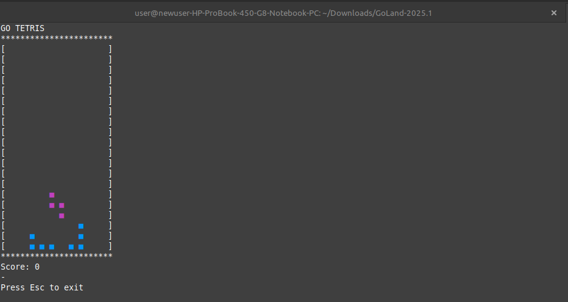

# Go Tetris

Golang implementation of the popular game Tetris.

Use the left and right arrows on your keyboard to move pieces from side-to-side. Use the up arrow to rotate the piece, and the down arrow to accelerate to the bottom of the grid.

## Build

`go build`

## Play

`./tetris`
